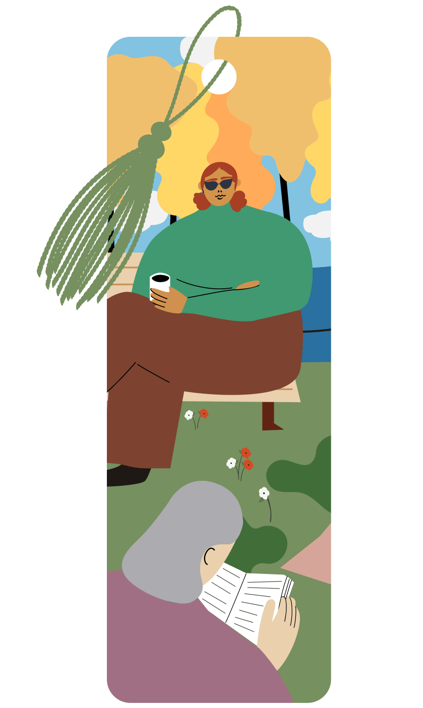
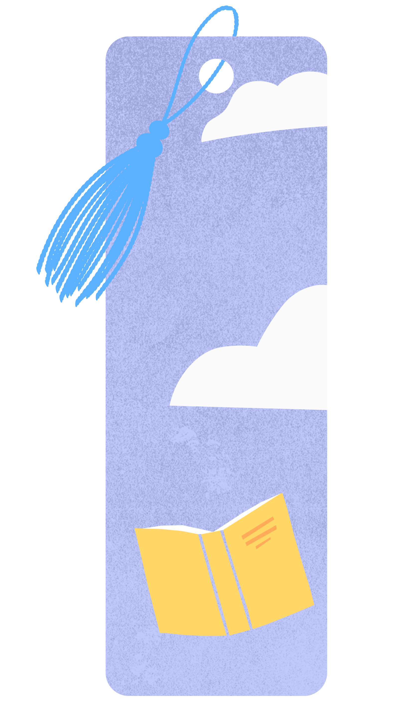
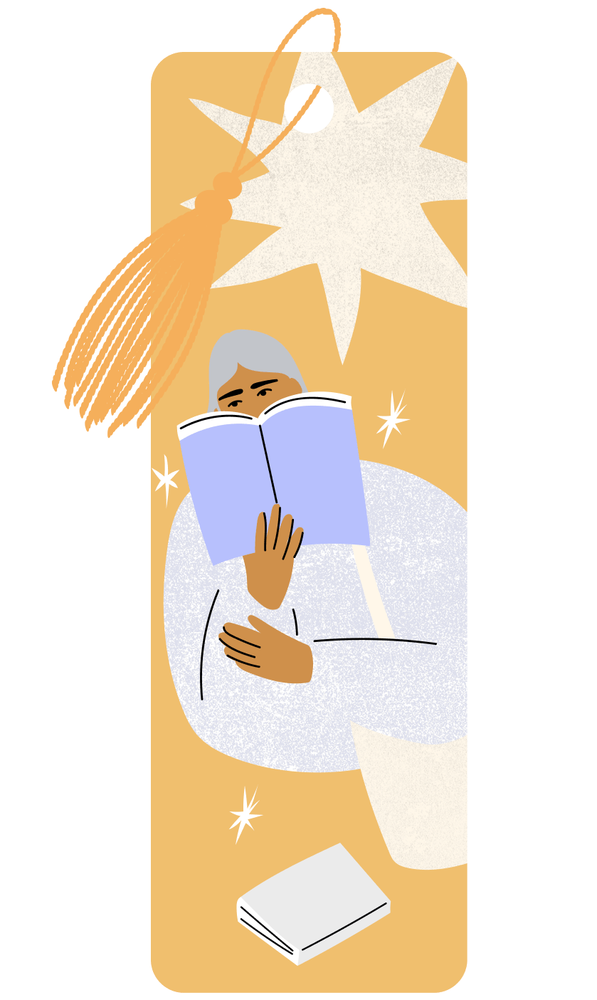
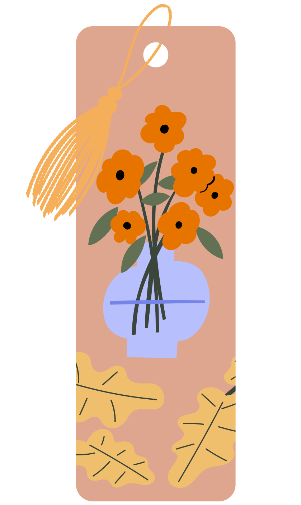

<!-- 
 -->

# 🏆 Goodreads Achievements 🏆

Goodreads reading achievements are a fun and rewarding way to celebrate your reading journey. Whether you’re setting annual reading goals, tackling seasonal challenges, or simply enjoying the joy of turning pages, these badges add an extra layer of motivation and accomplishment. Each badge represents a unique milestone, from reading a specific number of books to completing themed challenges, and they’re only available for a limited time—making them even more exciting to collect.

This guide is designed to help you navigate the world of Goodreads achievements, offering an overview of all available badges and how to unlock them. From reading books each month to participating in seasonal events, I’ll walk you through the steps to ensure you don’t miss out on any of these digital trophies. Let’s dive in and start collecting!

 

# 📃 Achievement List 📃
 

## Community Favorites Challenge (6)

|                                        Badge                                         |     Name     |                                                   How to get                                                    |
| :----------------------------------------------------------------------------------: | :----------: | :-------------------------------------------------------------------------------------------------------------: |
|    |  Epic Quest  |             Collect this achievement when you read one of the most loved fantasy titles by readers.             |
|   | Buzzy Books  |                    Collect this achievement when you complete one of these reader favorites                     |
|  | Era Explorer | Collect this achievement when you read one of the most popular historical fiction novels, according to readers. |
|               |   Mystery    |                                                      (???)                                                      |
|               |   Mystery    |                                                      (???)                                                      |
|               |   Mystery    |                                                      (???)                                                      |

 

## Monthly Reading Challenge (15)

|                                          Badge                                           |       Name       |                                                   How to get                                                    |
| :--------------------------------------------------------------------------------------: | :--------------: | :-------------------------------------------------------------------------------------------------------------: |
|            |  January Reader  |                                 Read at least one book in the month of January                                  |
|   | February Reader  |                                 Read at least one book in the month of February                                 |
|      |   March Reader   |                                  Read at least one book in the month of March                                   |
|      |   April Reader   |                                  Read at least one book in the month of April                                   |
|        |    May Reader    |                                   Read at least one book in the month of May                                    |
|       |   June Reader    |                                   Read at least one book in the month of June                                   |
|       |   July Reader    |                                   Read at least one book in the month of July                                   |
|     |  August Reader   |                                  Read at least one book in the month of August                                  |
|  | September Reader |                                Read at least one book in the month of September                                 |
|    |  October Reader  |                                 Read at least one book in the month of October                                  |
|   | November Reader  |                                 Read at least one book in the month of November                                 |
|   | December Reader  |                                 Read at least one book in the month of December                                 |
|        |    Grand Slam    |             Complete the set! Collect this achievement by finishing a book every month of the year.             |
|         |    Nailed It     | Collect this achievement by setting and reaching your reading goal. Eligible to collect starting on 12/17/2025. |
|        |    Stepped Up    |     One up your best self by completing more books than last year. Eligible to collect starting 12/23/2025.     |

 

# Previous Challenges

## Readers' Picks Challenge (5)
*September - December 2024*

|                                              Badge                                              |      Name       |                                                                 How to get                                                                 |
| :---------------------------------------------------------------------------------------------: | :-------------: | :----------------------------------------------------------------------------------------------------------------------------------------: |
|  | Sapphire Reader |    You're a gem! You collected this achievement by completing a book during this challenge. How many more achievements can you collect?    |
|     | Emerald Reader  |                         A precious feat! You collected this achievement by reading 3 books during this challenge.                          |
|     | Diamond Reader  |               Your brilliance shows! You collected this achievement by reading 5 books during the Readers' Picks challenge.                |
|                 |   Fall Vibes    |     Autumnally awesome! You collected this achievement by reading a book from the Fall Vibes list between October 16 and December 31.      |
|        |  Choice Awards  | You've got our vote! You collected this achievement by reading a 2024 Goodreads Choice Awards nominee between November 14 and December 31. |

<!-- 
 -->
 

_This page was inspired by user [drknzz](https://github.com/drknzz)'s [GitHub-Achievements](https://github.com/drknzz/GitHub-Achievements) repository_