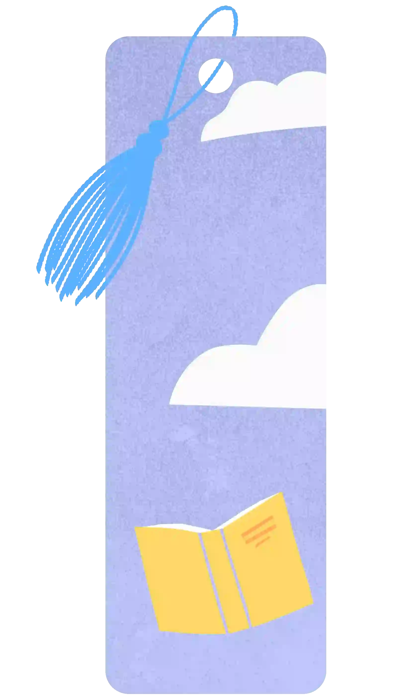
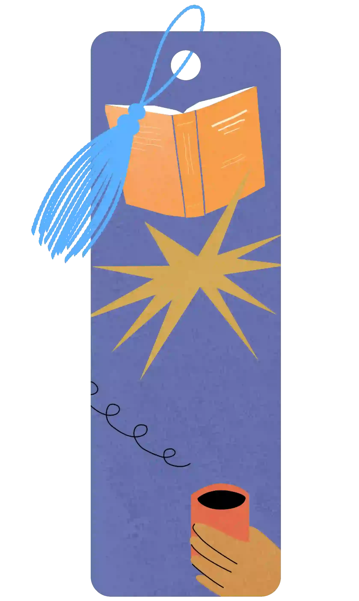

<h1>Goodreads Achievements Guide</h1>

The full list of Goodreads achievements! Learn how to unlock every badge, complete themed reading challenges, and earn monthly goals throughout 2025.

<h2>What are Goodreads Achievements?</h2>

Goodreads reading achievements are collectable badges you receive just by logging your reading progress. Each badge corresponds to different goals - from reading a specific number of books, to completing themed challenges - and they’re only available for a limited time.

This guide will help you get your Goodreads achievements, with an overview of all available badges and how to unlock them.

 

<h2>📃 2025 Achievement List 📃</h2>
<h3>Seasonal Challenge (7)</h3>
<strong>May 1 - June 30, 2025</strong>

Limited-time achievements to inspire you toward your annual goal

 

<table>
<tr align="center" valign="middle">
  <th>Badge</th>
  <th>Name</th>
  <th>How to get</th>
</tr>
<tr align="center" valign="middle">
  <td></td>
  <td>Page Turner</td>
  <td>Collect this achievement when you finish 2 books during the challenge.
</td>
</tr>
<tr align="center" valign="middle">
  <td></td>
  <td>Speed Reader</td>
  <td>Collect this achievement when you finish 3 books during the challenge.
</td>
</tr>
<tr align="center" valign="middle">
  <td></td>
  <td>Book Boss</td>
  <td>Collect this achievement when you finish 4 books during the challenge.
</td>
</tr>
<tr align="center" valign="middle">
  <td></td>
  <td>Centennial Picks</td>
  <td>Collect this achievement when you finish one of these popular books from the past 100 years between May 1 and June 30.
</td>
</tr>
<tr align="center" valign="middle">
  <td></td>
  <td>Heritage Reads</td>
  <td>Collect this achievement when you finish one of these books by AAPI and Asian authors between May 1 and June 30.</td>
</tr>
<tr align="center" valign="middle">
  <td></td>
  <td>Armchair Explorer</td>
  <td>Collect this achievement when you bask in the summertime sun by finishing one of these books between May 15 and June 30.
</td>
</tr>
<tr align="center" valign="middle">
  <td></td>
  <td>Rainbow Reads</td>
  <td>Collect this achievement when you finish one of these LGBTQ+ books between June 1 and June 30.
</td>
</tr>
</table>

<h3>Community Favorites Challenge (6)</h3>
<strong>January - April 2025</strong>

<table>
<tr align="center" valign="middle">
  <th>Badge</th>
  <th>Name</th>
  <th>How to get</th>
</tr>
<tr align="center" valign="middle">
  <td></td>
  <td>Epic Quest</td>
  <td>Collect this achievement when you read one of the most loved fantasy titles by readers.</td>
</tr>
<tr align="center" valign="middle">
  <td></td>
  <td>Buzzy Books</td>
  <td>Collect this achievement when you complete one of these reader favorites</td>
</tr>
<tr align="center" valign="middle">
  <td></td>
  <td>Era Explorer</td>
  <td>Collect this achievement when you read one of the most popular historical fiction novels, according to readers.</td>
</tr>
<tr align="center" valign="middle">
  <td></td>
  <td>Essential Reader</td>
  <td>Collect this achievement when you read one of these essential books from black authors.</td>
</tr>
<tr align="center" valign="middle">
  <td></td>
  <td>Her Story</td>
  <td>Collect this achievement when you read one of these fascinating titles about and by women.</td>
</tr>
<tr align="center" valign="middle">
  <td></td>
  <td>Sweet and Spicy</td>
  <td>Collect this achievement when you read one of these sweet or spicy romances.</td>
</tr>
</table>

 

  <h3>Monthly Reading Challenge (15)</h3>
  <strong>January 1 - December 31, 2025</strong>
 

<table>
<tr align="center" valign="center">
  <th>Badge</th>
  <th>Name</th>
  <th>How to get</th>
</tr>
<tr align="center" valign="center">
  <td></td>
  <td>January Reader</td>
  <td>Read at least one book in the month of January</td>
</tr>
<tr align="center" valign="center">
  <td></td>
  <td>February Reader</td>
  <td>Read at least one book in the month of February</td>
</tr>
<tr align="center" valign="center">
  <td></td>
  <td>March Reader</td>
  <td>Read at least one book in the month of March</td>
</tr>
<tr align="center" valign="center">
  <td></td>
  <td>April Reader</td>
  <td>Read at least one book in the month of April</td>
</tr>
<tr align="center" valign="center">
  <td></td>
  <td>May Reader</td>
  <td>Read at least one book in the month of May</td>
</tr>
<tr align="center" valign="center">
  <td></td>
  <td>June Reader</td>
  <td>Read at least one book in the month of June</td>
</tr>
<tr align="center" valign="center">
  <td></td>
  <td>July Reader</td>
  <td>Read at least one book in the month of July</td>
</tr>
<tr align="center" valign="center">
  <td></td>
  <td>August Reader</td>
  <td>Read at least one book in the month of August</td>
</tr>
<tr align="center" valign="center">
  <td></td>
  <td>September Reader</td>
  <td>Read at least one book in the month of September</td>
</tr>
<tr align="center" valign="center">
  <td></td>
  <td>October Reader</td>
  <td>Read at least one book in the month of October</td>
</tr>
<tr align="center" valign="center">
  <td></td>
  <td>November Reader</td>
  <td>Read at least one book in the month of November</td>
</tr>
<tr align="center" valign="center">
  <td></td>
  <td>December Reader</td>
  <td>Read at least one book in the month of December</td>
</tr>
<tr align="center" valign="center">
  <td></td>
  <td>Grand Slam</td>
  <td>Complete the set! Collect this achievement by finishing a book every month of the year.</td>
</tr>
<tr align="center" valign="center">
  <td></td>
  <td>Nailed It</td>
  <td>Collect this achievement by setting and reaching your reading goal. Eligible to collect starting on 12/17/2025.</td>
</tr>
<tr align="center" valign="center">
  <td></td>
  <td>Stepped Up</td>
  <td>One up your best self by completing more books than last year. Eligible to collect starting 12/23/2025.</td>
</tr>
</table>

 

<h2>Previous Challenges</h2>
<h3>Readers' Picks Challenge (5)</h3>
<strong>September - December 2024</strong>

<table>
<tr align="center" valign="center" valign="center">
  <th>Badge</th>
  <th>Name</th>
  <th>How to get</th>
</tr>
<tr align="center" valign="center">
  <td></td>
  <td>Sapphire Reader</td>
  <td>You're a gem! You collected this achievement by completing a book during this challenge. How many more achievements can you collect?</td>
</tr>
<tr align="center" valign="center">
  <td></td>
  <td>Emerald Reader</td>
  <td>A precious feat! You collected this achievement by reading 3 books during this challenge.
</td>
</tr>
<tr align="center" valign="center">
  <td></td>
  <td>Diamond Reader</td>
  <td>Your brilliance shows! You collected this achievement by reading 5 books during the Readers' Picks challenge.</td>
</tr>
<tr align="center" valign="center">
  <td></td>
  <td>Fall Vibes</td>
  <td>Autumnally awesome! You collected this achievement by reading a book from the Fall Vibes list between October 16 and December 31.</td>
</tr>
<tr align="center" valign="center">
  <td></td>
  <td>Choice Awards</td>
  <td>You've got our vote! You collected this achievement by reading a 2024 Goodreads Choice Awards nominee between November 14 and December 31.
</td>
</tr>
<tr align="center" valign="center">
  <td colspan="3"><h3 class="cta"><a href="https://github.com/BenRogersWPG/Goodreads-Achievements#-goodreads-achievements-" title="View FULL list on GitHub">View FULL list on GitHub</a></h3></td>
</tr>
</table>

Make your <i>"good reads"</i> even better with these rewarding digital trophies!

