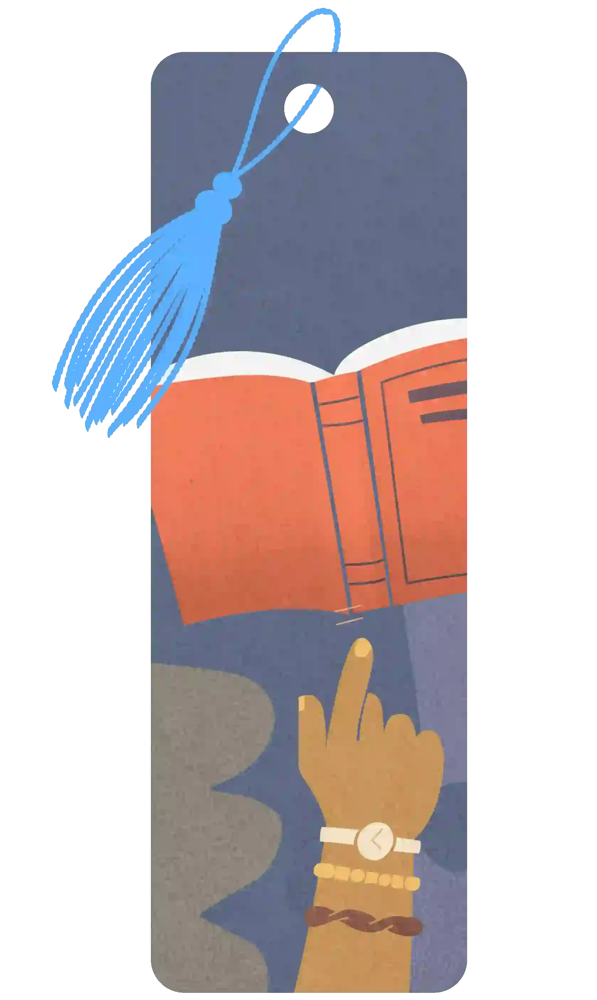
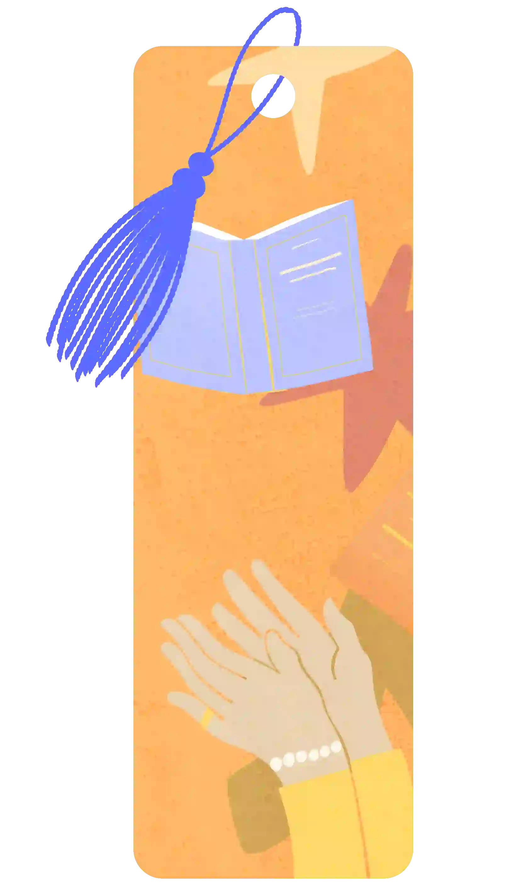
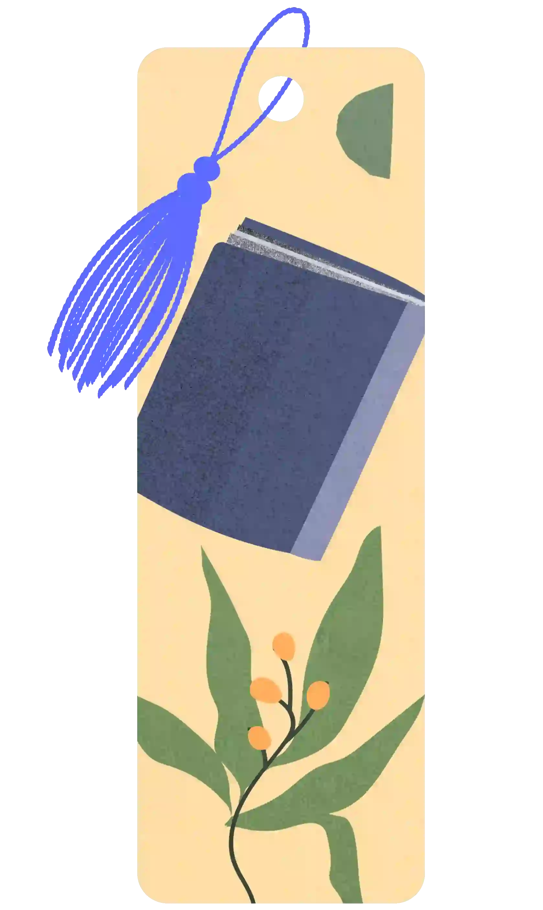

<h1>Goodreads Achievements Guide</h1>

The full list of Goodreads achievements! Learn how to unlock every badge, complete themed reading challenges, and earn monthly goals throughout 2025.

<h2>What are Goodreads Achievements?</h2>

Goodreads reading achievements are collectable badges you receive just by logging your reading progress. Each badge corresponds to different goals - from reading a specific number of books, to completing themed challenges - and they’re only available for a limited time.

This guide will help you get your Goodreads and Kindle achievements, with an overview of all available badges and how to unlock them.

 

<h2>📃 2025 Achievement List 📃</h2>
<h3>Fall Challenge (12)</h3>
<strong>September 15 - December 31, 2025</strong>

2025's final achievement season, to inspire you toward your annual goal

 

<table>
<tr>
  <th>Badge</th>
  <th>Name</th>
  <th>How to get</th>
</tr>
<tr>
  <td></td>
  <td>Page-Turner</td>
  <td>Collect this achievement when you finish any 2 books between September 15 - December 31.
</td>
</tr>
<tr>
  <td></td>
  <td>Speed Reader</td>
  <td>Collect this achievement when you finish any 3 books between September 15 - December 31.
</td>
</tr>
<tr>
  <td></td>
  <td>Book Boss</td>
  <td>Collect this achievement when you finish any 5 books between September 15 - December 31.
</td>
</tr>
<tr>
  <td></td>
  <td>Community Picks</td>
  <td>Your fellow readers voted across our social media channels for this one! Collect this achievement when you finish one of these dark academia fiction books between Sept. 15 and Dec. 31.
</td>
</tr>
<tr>
  <td></td>
  <td>Hispanic Heritage</td>
  <td>Collect this achievement when you finish one of these books for Hispanic Heritage Month between Sept. 15 and Dec. 31.
</td>
</tr>
<tr>
  <td></td>
  <td>Mystery</td>
  <td>Hint: Boo! Reveals on 10/1/2025
</td>
</tr>
<tr>
  <td></td>
  <td>Mystery</td>
  <td>Hint: Best served with a mug of hot chocolate Reveals on 10/1/2025
</td>
</tr>
<tr>
  <td></td>
  <td>Mystery</td>
  <td>Hint: A look back Reveals on 10/1/2025
</td>
</tr>
<tr>
  <td></td>
  <td>Mystery</td>
  <td>Hint: You can't make this stuff up Reveals on 10/1/2025
</td>
</tr>
<tr>
  <td></td>
  <td>Mystery</td>
  <td>Hint: Celebrating heritage Reveals on 11/1/2025
</td>
</tr>
<tr>
  <td></td>
  <td>Mystery</td>
  <td>Hint: Short and sweet Reveals on 11/1/2025
</td>
</tr>
<tr>
  <td></td>
  <td>Mystery</td>
  <td>Hint: Drumroll, please Reveals on 11/11/2025
</td>
</tr>
</table>

<h2>📃 2025 Achievement List 📃</h2>
<h3>Summer Challenge (9)</h3>
<strong>July 1 - September 14, 2025</strong>

Page-turning season is here! And so are summertime achievements.

 

<table>
<tr>
  <th>Badge</th>
  <th>Name</th>
  <th>How to get</th>
</tr>
<tr>
  <td></td>
  <td>Page-Turner</td>
  <td>Collect this achievement when you finish any 2 books between July 1 and September 14.
</td>
</tr>
<tr>
  <td></td>
  <td>Speed Reader</td>
  <td>Collect this achievement when you finish any 3 books between July 1 and September 14.
</td>
</tr>
<tr>
  <td></td>
  <td>Book Boss</td>
  <td>Collect this achievement when you finish any 5 books between July 1 and September 14.
</td>
</tr>
<tr>
  <td></td>
  <td>Challenge Faves</td>
  <td>Collect this achievement when you finish one of the most-read books of the 2025 Reading Challenge (so far) between July 1 and September 14.
</td>
</tr>
<tr>
  <td></td>
  <td>Poolside Puzzlers</td>
  <td>Collect this achievement when you finish one of these beach-ready mysteries and thrillers between July 1 and September 14.
</td>
</tr>
<tr>
  <td></td>
  <td>Chart Toppers</td>
  <td>Collect this achievement when you finish one of these hit new books from the first half of the year between July 8 and September 14.
</td>
</tr>
<tr>
  <td></td>
  <td>Acclaimed Titles</td>
  <td>Pulitzers, Hugos, Bookers, oh my! Collect this achievement when you finish one of these award-winning books between July 15 and September 14.
</td>
</tr>
<tr>
  <td></td>
  <td>Debut Darlings</td>
  <td>Collect this achievement when you finish one of these books by first-time authors between August 1 and September 14.
</td>
</tr>
<tr>
  <td></td>
  <td>Lightning Round</td>
  <td>Collect this achievement when you finish one of these books--of varying length--in a month or less, between August 14 and September 14.
</td>
</tr>
</table>

<h3>Seasonal Challenge (7)</h3>
<strong>May 1 - June 30, 2025</strong>

Limited-time achievements to inspire you toward your annual goal

 

<table>
<tr>
  <th>Badge</th>
  <th>Name</th>
  <th>How to get</th>
</tr>
<tr>
  <td></td>
  <td>Page-Turner</td>
  <td>Collect this achievement when you finish 2 books during the challenge.
</td>
</tr>
<tr>
  <td></td>
  <td>Speed Reader</td>
  <td>Collect this achievement when you finish 3 books during the challenge.
</td>
</tr>
<tr>
  <td></td>
  <td>Book Boss</td>
  <td>Collect this achievement when you finish 4 books during the challenge.
</td>
</tr>
<tr>
  <td></td>
  <td>Centennial Picks</td>
  <td>Collect this achievement when you finish one of these popular books from the past 100 years between May 1 and June 30.
</td>
</tr>
<tr>
  <td></td>
  <td>Heritage Reads</td>
  <td>Collect this achievement when you finish one of these books by AAPI and Asian authors between May 1 and June 30.</td>
</tr>
<tr>
  <td></td>
  <td>Armchair Explorer</td>
  <td>Collect this achievement when you bask in the summertime sun by finishing one of these books between May 15 and June 30.
</td>
</tr>
<tr>
  <td></td>
  <td>Rainbow Reads</td>
  <td>Collect this achievement when you finish one of these LGBTQ+ books between June 1 and June 30.
</td>
</tr>
</table>

<h3>Community Favorites Challenge (6)</h3>
<strong>January - April 2025</strong>

<table>
<tr>
  <th>Badge</th>
  <th>Name</th>
  <th>How to get</th>
</tr>
<tr>
  <td></td>
  <td>Epic Quest</td>
  <td>Collect this achievement when you read one of the most loved fantasy titles by readers.</td>
</tr>
<tr>
  <td></td>
  <td>Buzzy Books</td>
  <td>Collect this achievement when you complete one of these reader favorites</td>
</tr>
<tr>
  <td></td>
  <td>Era Explorer</td>
  <td>Collect this achievement when you read one of the most popular historical fiction novels, according to readers.</td>
</tr>
<tr>
  <td></td>
  <td>Essential Reader</td>
  <td>Collect this achievement when you read one of these essential books from black authors.</td>
</tr>
<tr>
  <td></td>
  <td>Her Story</td>
  <td>Collect this achievement when you read one of these fascinating titles about and by women.</td>
</tr>
<tr>
  <td></td>
  <td>Sweet and Spicy</td>
  <td>Collect this achievement when you read one of these sweet or spicy romances.</td>
</tr>
</table>

 

  <h3>Monthly Reading Challenge (15)</h3>
  <strong>January 1 - December 31, 2025</strong>
 

<table>
<tr>
  <th>Badge</th>
  <th>Name</th>
  <th>How to get</th>
</tr>
<tr>
  <td></td>
  <td>January Reader</td>
  <td>Read at least one book in the month of January</td>
</tr>
<tr>
  <td></td>
  <td>February Reader</td>
  <td>Read at least one book in the month of February</td>
</tr>
<tr>
  <td></td>
  <td>March Reader</td>
  <td>Read at least one book in the month of March</td>
</tr>
<tr>
  <td></td>
  <td>April Reader</td>
  <td>Read at least one book in the month of April</td>
</tr>
<tr>
  <td></td>
  <td>May Reader</td>
  <td>Read at least one book in the month of May</td>
</tr>
<tr>
  <td></td>
  <td>June Reader</td>
  <td>Read at least one book in the month of June</td>
</tr>
<tr>
  <td></td>
  <td>July Reader</td>
  <td>Read at least one book in the month of July</td>
</tr>
<tr>
  <td></td>
  <td>August Reader</td>
  <td>Read at least one book in the month of August</td>
</tr>
<tr>
  <td></td>
  <td>September Reader</td>
  <td>Read at least one book in the month of September</td>
</tr>
<tr>
  <td></td>
  <td>October Reader</td>
  <td>Read at least one book in the month of October</td>
</tr>
<tr>
  <td></td>
  <td>November Reader</td>
  <td>Read at least one book in the month of November</td>
</tr>
<tr>
  <td></td>
  <td>December Reader</td>
  <td>Read at least one book in the month of December</td>
</tr>
<tr>
  <td></td>
  <td>Grand Slam</td>
  <td>Complete the set! Collect this achievement by finishing a book every month of the year.</td>
</tr>
<tr>
  <td></td>
  <td>Nailed It</td>
  <td>Collect this achievement by setting and reaching your reading goal. Eligible to collect starting on 12/17/2025.</td>
</tr>
<tr>
  <td></td>
  <td>Stepped Up</td>
  <td>One up your best self by completing more books than last year. Eligible to collect starting 12/23/2025.</td>
</tr>
</table>

 

<h2>Previous Challenges</h2>
<h3>Readers' Picks Challenge (5)</h3>
<strong>September - December 2024</strong>

<table>
<tr>
  <th>Badge</th>
  <th>Name</th>
  <th>How to get</th>
</tr>
<tr>
  <td></td>
  <td>Sapphire Reader</td>
  <td>You're a gem! You collected this achievement by completing a book during this challenge. How many more achievements can you collect?</td>
</tr>
<tr>
  <td></td>
  <td>Emerald Reader</td>
  <td>A precious feat! You collected this achievement by reading 3 books during this challenge.
</td>
</tr>
<tr>
  <td></td>
  <td>Diamond Reader</td>
  <td>Your brilliance shows! You collected this achievement by reading 5 books during the Readers' Picks challenge.</td>
</tr>
<tr>
  <td></td>
  <td>Fall Vibes</td>
  <td>Autumnally awesome! You collected this achievement by reading a book from the Fall Vibes list between October 16 and December 31.</td>
</tr>
<tr>
  <td></td>
  <td>Choice Awards</td>
  <td>You've got our vote! You collected this achievement by reading a 2024 Goodreads Choice Awards nominee between November 14 and December 31.
</td>
</tr>
<tr>
  <td colspan="3"><h3 class="cta"><a href="https://github.com/BenRogersWPG/Goodreads-Achievements#-goodreads-achievements-" title="View FULL list on GitHub">View FULL list on GitHub</a></h3></td>
</tr>
</table>

Make your <em>"good reads"</em> even better with these rewarding digital trophies!

